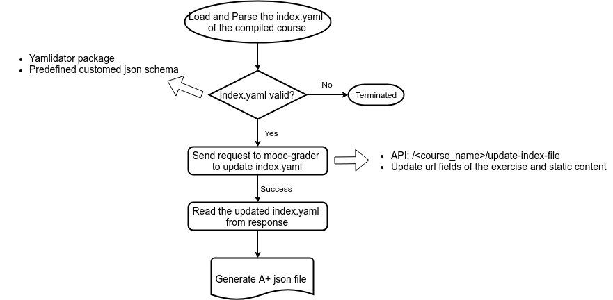

# A+ json generation

A docker container for A+ deploy. Running the container generates A+ json file in the course directory built by [roman](https://github.com/apluslms/roman).

[Mooc-grader](https://github.com/apluslms/mooc-grader) with deploy_api feature is required to run.  See the [A-plus template course](https://github.com/apluslms/course-templates)
that includes a Docker compose configuration file to develop and test course content.

### Workflow
The figure shows the workflow within the container. 

The validation of index.yaml uses the package aplus-yamlidator available in the [roman](https://github.com/apluslms/roman).
The customed schemas for validation are put under the directory `schemas/`.

Several environment variables need to be provided for the authentication of the request. The detailed info is available in
[apluslms-file-transfer](https://github.com/apluslms/apluslms-file-transfer)

### For development and test
A predefined schema for the [A-plus template course](https://github.com/apluslms/course-templates) is `schemas/index-v.1.0.yaml`, 
and it is the schema used in the container of the current version. 

`scripts/local_run.sh` provides an example running the container localy. The script needs to run under the course repo (example: [A-plus template course](https://github.com/apluslms/course-templates))

